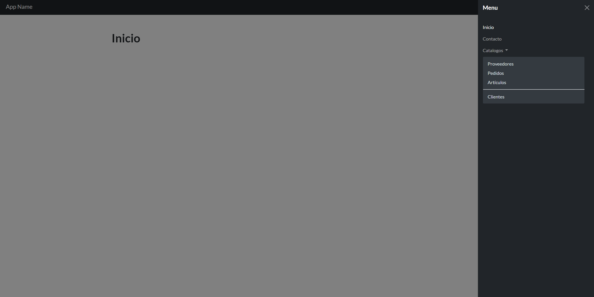
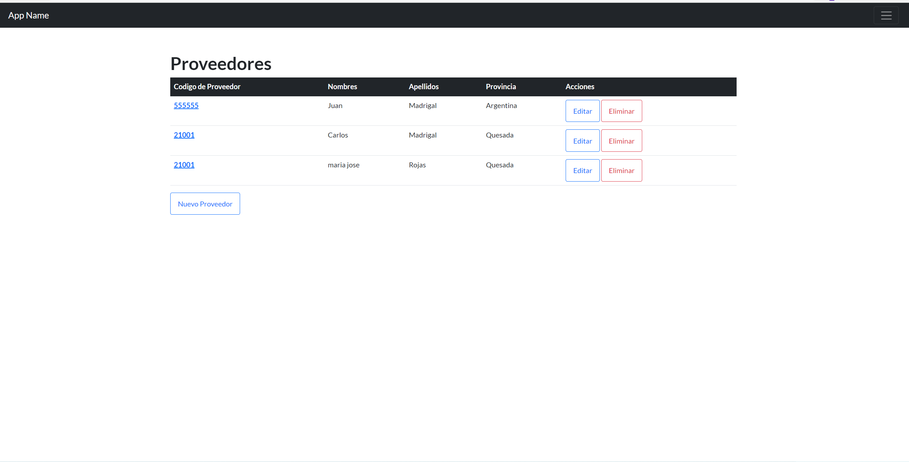
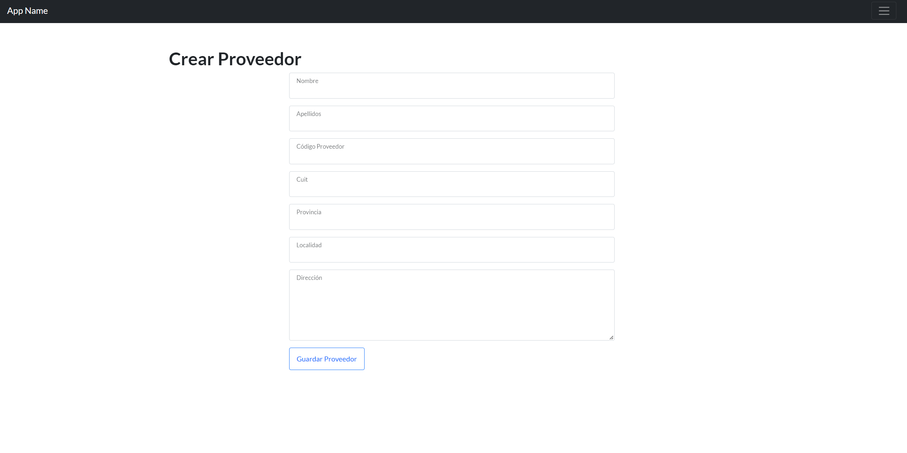
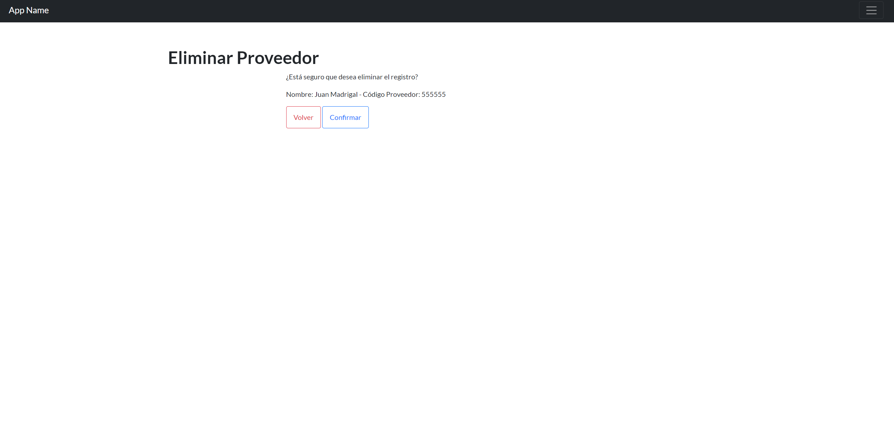

# Proyecto Final Python CoderHouse

## Detalles del proyecto

    Participantes: 
    - Jose Mailhet 
    - Joel Kuchen
    - Jorge Alonso Rojas Pérez

    Descripción:

## Resultado pantalla de inicio

## Resultados Proveedores CRUD

    Se muestra una tabla para listar los proveedores, la pantala de confirmación para eliminar y el formulario usado para actualizar y crear 

